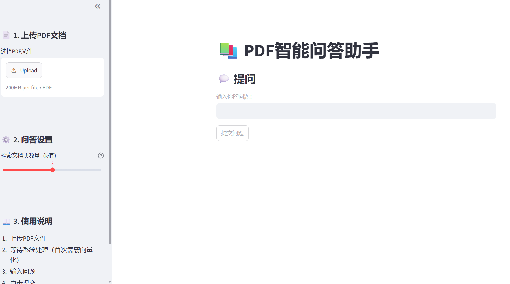
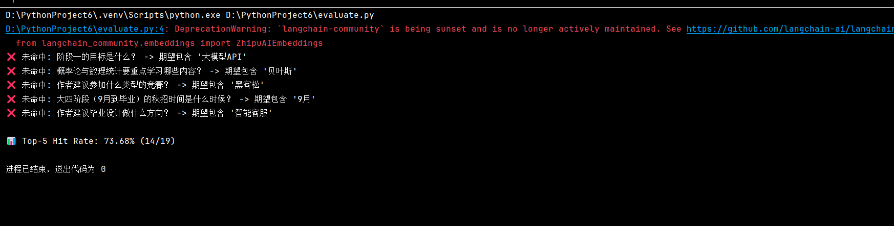
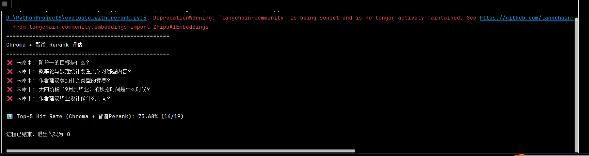

# PDF问答助手

上传PDF文档，用自然语言提问，AI从文档中检索并回答。

## 核心功能

- 📄 支持 PDF 文档上传与解析
- 🔍 基于 RAG 架构的智能检索
- 💬 自然语言问答交互
- 📊 内置检索效果评估体系

## 技术栈

- Python 3.10+
- Streamlit（Web 界面）
- LangChain（RAG 流程编排，含 `langchain-classic` 兼容层）
- Chroma（向量数据库，持久化存储）
- 智谱 GLM-4（大模型）
- 智谱 GLM-Rerank（精排优化）


## 在线体验

\[https://pdf-app-assistant-xogchwtvcwzl4dv88wmljj.streamlit.app/]

\## 项目截图



## 评估结果

使用 19 个问题测试检索效果（Top-5 Hit Rate）。

| 方案 | Hit Rate |
| :--- | :--- |
| 纯 Chroma 检索（基线） | 73.68% |
| Chroma + 智谱 Rerank | 73.68%（Rerank 接口已调通） |

> 说明：Rerank 接口已成功接入，在现有测试集上效果与基线一致，将在后续使用更多样化的测试集进一步验证精排效果。


### 基线：纯 Chroma 检索



- Top-5 Hit Rate = 73.68%

### 优化后：Chroma + 智谱 Rerank



- Top-5 Hit Rate = 73.68%（Rerank 接口已调通）

 ## 项目结构

```text
pdf-qa-assistant/
├── app.py                          # 主程序
├── evaluate.py                     # 基线评估脚本
├── evaluate_with_rerank.py         # Rerank 评估脚本
├── eval_data.json                  # 测试集
├── requirements.txt                # 依赖列表
└── images/                         # 截图
```
注：后续计划在更复杂的测试集上验证其效果
